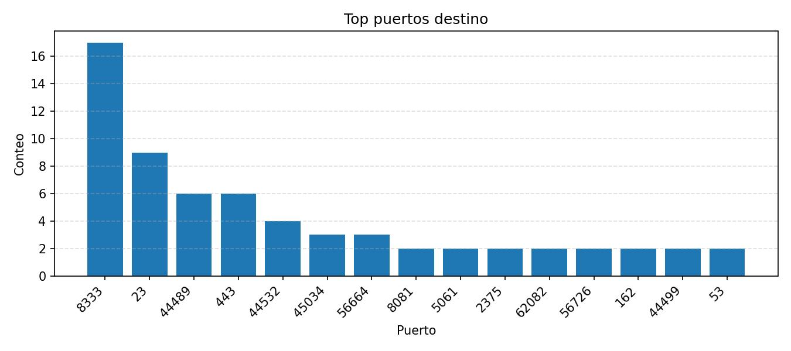
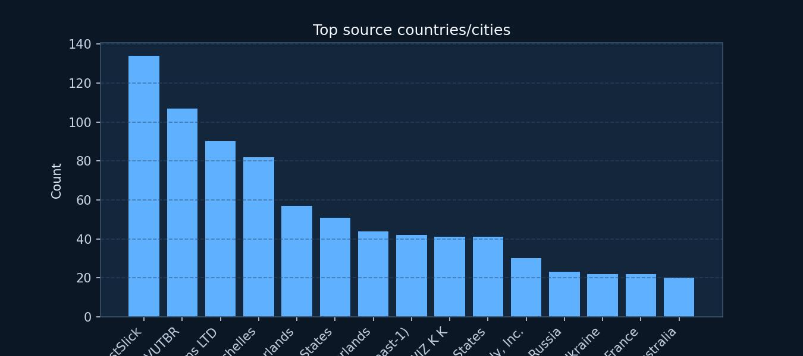
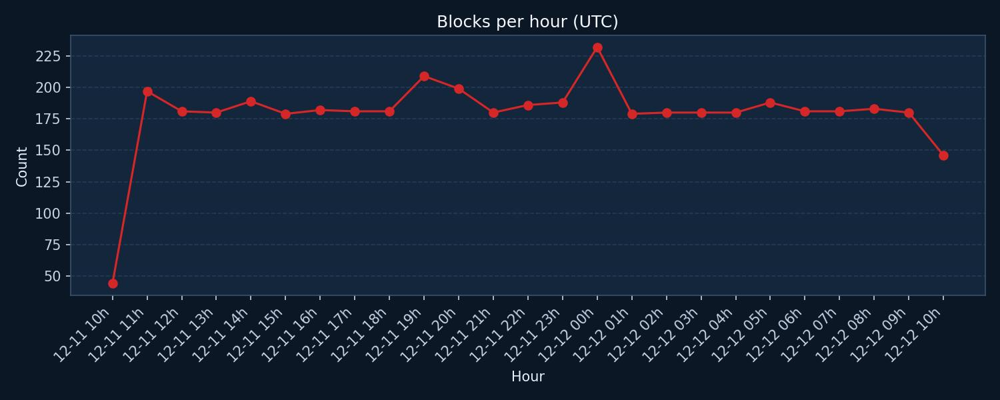
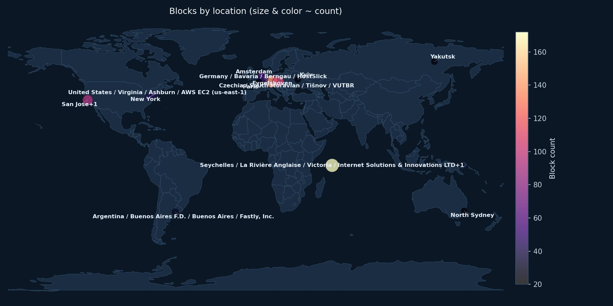

# UFW Block Report

- Log: `/var/log/ufw.log`
- Window: last 24.0 hours
- Total blocks: 4405
- Unique source IPs: 2596
- Unique countries/cities (24h): 384
- Unique destination ports: 2427

## Top destination ports
| # | Destination port | Count | % |
| ---: | --- | ---: | ---: |
| 1 | `23` | 109 | 2.5% |
| 2 | `unknown` | 80 | 1.8% |
| 3 | `22` | 64 | 1.5% |
| 4 | `8080` | 55 | 1.2% |
| 5 | `5555` | 40 | 0.9% |
| 6 | `27015` | 31 | 0.7% |
| 7 | `53` | 31 | 0.7% |
| 8 | `5060` | 30 | 0.7% |
| 9 | `1433` | 30 | 0.7% |
| 10 | `8081` | 28 | 0.6% |
| 11 | `8443` | 27 | 0.6% |
| 12 | `8000` | 25 | 0.6% |
| 13 | `3389` | 24 | 0.5% |
| 14 | `9200` | 23 | 0.5% |
| 15 | `2222` | 21 | 0.5% |

## Top protocols
| # | Protocol | Count | % |
| ---: | --- | ---: | ---: |
| 1 | `TCP` | 3695 | 83.9% |
| 2 | `UDP` | 630 | 14.3% |
| 3 | `47` | 79 | 1.8% |
| 4 | `41` | 1 | 0.0% |

## Top source IPs
| # | Source IP | Count | % |
| ---: | --- | ---: | ---: |
| 1 | `192.168.100.29` | 109 | 2.5% |
| 2 | `177.124.24.122` | 38 | 0.9% |
| 3 | `79.63.45.2` | 31 | 0.7% |
| 4 | `93.123.72.183` | 19 | 0.4% |
| 5 | `3.87.27.156` | 19 | 0.4% |
| 6 | `85.217.149.48` | 17 | 0.4% |
| 7 | `85.217.149.17` | 16 | 0.4% |
| 8 | `204.76.203.15` | 15 | 0.3% |
| 9 | `172.93.106.153` | 14 | 0.3% |
| 10 | `18.189.74.1` | 13 | 0.3% |
| 11 | `18.119.209.50` | 13 | 0.3% |
| 12 | `5.187.35.142` | 12 | 0.3% |
| 13 | `3.131.24.55` | 11 | 0.2% |
| 14 | `85.217.149.20` | 11 | 0.2% |
| 15 | `185.224.128.16` | 11 | 0.2% |

## Top TCP flag patterns
| # | Flags | Count | % |
| ---: | --- | ---: | ---: |
| 1 | `SYN` | 3510 | 95.0% |
| 2 | `ACK+PSH` | 91 | 2.5% |
| 3 | `ACK+FIN+PSH` | 66 | 1.8% |
| 4 | `ACK+FIN` | 14 | 0.4% |
| 5 | `SYN+ECE+CWR` | 10 | 0.3% |
| 6 | `ACK` | 3 | 0.1% |
| 7 | `ACK+RST` | 1 | 0.0% |

## Top inbound interfaces (IN)
| # | Interface | Count | % |
| ---: | --- | ---: | ---: |
| 1 | `eth0` | 4392 | 99.7% |
| 2 | `wlan0` | 13 | 0.3% |

## Top source IP -> destination port
| # | Source IP -> port | Count | % |
| ---: | --- | ---: | ---: |
| 1 | `79.63.45.2` -> `23` | 31 | 0.7% |
| 2 | `222.79.104.148` -> `6379` | 9 | 0.2% |
| 3 | `69.17.52.1` -> `8333` | 9 | 0.2% |
| 4 | `94.156.152.50` -> `23` | 9 | 0.2% |
| 5 | `62.210.142.169` -> `8080` | 8 | 0.2% |
| 6 | `192.168.100.1` -> `68` | 7 | 0.2% |
| 7 | `45.198.224.18` -> `8728` | 6 | 0.1% |
| 8 | `216.180.246.74` -> `80` | 6 | 0.1% |
| 9 | `54.203.116.214` -> `61835` | 6 | 0.1% |
| 10 | `188.166.238.237` -> `23` | 6 | 0.1% |
| 11 | `178.20.210.152` -> `1723` | 5 | 0.1% |
| 12 | `93.123.72.183` -> `82` | 5 | 0.1% |
| 13 | `17.57.144.153` -> `51367` | 5 | 0.1% |
| 14 | `93.123.72.183` -> `88` | 5 | 0.1% |
| 15 | `66.132.195.68` -> `8642` | 5 | 0.1% |

## Blocks per hour (UTC)
| Hour (UTC) | Count | % |
| :--- | ---: | ---: |
| 2026-06-21 04:00:00:00 | 133 | 3.0% |
| 2026-06-21 05:00:00:00 | 181 | 4.1% |
| 2026-06-21 06:00:00:00 | 190 | 4.3% |
| 2026-06-21 07:00:00:00 | 181 | 4.1% |
| 2026-06-21 08:00:00:00 | 180 | 4.1% |
| 2026-06-21 09:00:00:00 | 180 | 4.1% |
| 2026-06-21 10:00:00:00 | 186 | 4.2% |
| 2026-06-21 11:00:00:00 | 179 | 4.1% |
| 2026-06-21 12:00:00:00 | 180 | 4.1% |
| 2026-06-21 13:00:00:00 | 176 | 4.0% |
| 2026-06-21 14:00:00:00 | 183 | 4.2% |
| 2026-06-21 15:00:00:00 | 175 | 4.0% |
| 2026-06-21 16:00:00:00 | 185 | 4.2% |
| 2026-06-21 17:00:00:00 | 180 | 4.1% |
| 2026-06-21 18:00:00:00 | 183 | 4.2% |
| 2026-06-21 19:00:00:00 | 178 | 4.0% |
| 2026-06-21 20:00:00:00 | 182 | 4.1% |
| 2026-06-21 21:00:00:00 | 180 | 4.1% |
| 2026-06-21 22:00:00:00 | 180 | 4.1% |
| 2026-06-21 23:00:00:00 | 194 | 4.4% |
| 2026-06-22 00:00:00:00 | 216 | 4.9% |
| 2026-06-22 01:00:00:00 | 184 | 4.2% |
| 2026-06-22 02:00:00:00 | 192 | 4.4% |
| 2026-06-22 03:00:00:00 | 178 | 4.0% |
| 2026-06-22 04:00:00:00 | 49 | 1.1% |

## Top source countries/cities
| # | Location | Count | % |
| ---: | --- | ---: | ---: |
| 1 | private | 109 | 31.2% |
| 2 | Santa Clara do Sul, Brazil | 38 | 10.9% |
| 3 | Dublin, United States | 37 | 10.6% |
| 4 | Rome, Italy | 31 | 8.9% |
| 5 | New York, United States | 27 | 7.7% |
| 6 | Amsterdam, The Netherlands | 23 | 6.6% |
| 7 | Amsterdam, Netherlands | 19 | 5.4% |
| 8 | Ashburn, United States | 19 | 5.4% |
| 9 | Beauharnois, Canada | 17 | 4.9% |
| 10 | Eygelshoven, Netherlands | 15 | 4.3% |
| 11 | Piscataway, United States | 14 | 4.0% |

## Geolocation (max 15 IPs)
| # | Source IP | Count | % | Location | Network / hint |
| ---: | --- | ---: | ---: | --- | --- |
| 1 | `192.168.100.29` | 109 | 31.2% | private | Private/CGNAT |
| 2 | `177.124.24.122` | 38 | 10.9% | Brazil / Rio Grande do Sul / Santa Clara do Sul / ROALNET SOLUÇÕES WEB LTDA | No apparent signal |
| 3 | `79.63.45.2` | 31 | 8.9% | Italy / Lazio / Rome / INTERBUSINESS | Mobile/CGNAT (telecom italia) |
| 4 | `93.123.72.183` | 19 | 5.4% | Netherlands / North Holland / Amsterdam / Amarutu Technology Ltd | No apparent signal |
| 5 | `3.87.27.156` | 19 | 5.4% | United States / Virginia / Ashburn / AWS EC2 (us-east-1) | Hosting/Cloud (aws) |
| 6 | `85.217.149.48` | 17 | 4.9% | Canada / Quebec / Beauharnois / Modat B.V | No apparent signal |
| 7 | `85.217.149.17` | 16 | 4.6% | United States / New York / New York / Modat B.V | No apparent signal |
| 8 | `204.76.203.15` | 15 | 4.3% | Netherlands / Limburg / Eygelshoven / Intelligence Hosting LLC | No apparent signal |
| 9 | `172.93.106.153` | 14 | 4.0% | United States / New Jersey / Piscataway / Klemen Stirn | No apparent signal |
| 10 | `18.189.74.1` | 13 | 3.7% | United States / Ohio / Dublin / AWS EC2 (us-east-2) | Hosting/Cloud (aws) |
| 11 | `18.119.209.50` | 13 | 3.7% | United States / Ohio / Dublin / AWS EC2 (us-east-2) | Hosting/Cloud (aws) |
| 12 | `5.187.35.142` | 12 | 3.4% | The Netherlands / North Holland / Amsterdam / Amarutu Technology Ltd | No apparent signal |
| 13 | `3.131.24.55` | 11 | 3.2% | United States / Ohio / Dublin / AWS EC2 (us-east-2) | Hosting/Cloud (aws) |
| 14 | `85.217.149.20` | 11 | 3.2% | United States / New York / New York / Modat B.V | No apparent signal |
| 15 | `185.224.128.16` | 11 | 3.2% | The Netherlands / North Holland / Amsterdam / Alsycon B.V | No apparent signal |

## VPN/Proxy/Hosting suspicion (heuristic)
| # | Source IP | Count | % | Suspicion | Location |
| ---: | --- | ---: | ---: | --- | --- |
| 1 | `3.87.27.156` | 19 | 33.9% | Hosting/Cloud (aws) | United States / Virginia / Ashburn / AWS EC2 (us-east-1) |
| 2 | `18.189.74.1` | 13 | 23.2% | Hosting/Cloud (aws) | United States / Ohio / Dublin / AWS EC2 (us-east-2) |
| 3 | `18.119.209.50` | 13 | 23.2% | Hosting/Cloud (aws) | United States / Ohio / Dublin / AWS EC2 (us-east-2) |
| 4 | `3.131.24.55` | 11 | 19.6% | Hosting/Cloud (aws) | United States / Ohio / Dublin / AWS EC2 (us-east-2) |

## Charts

