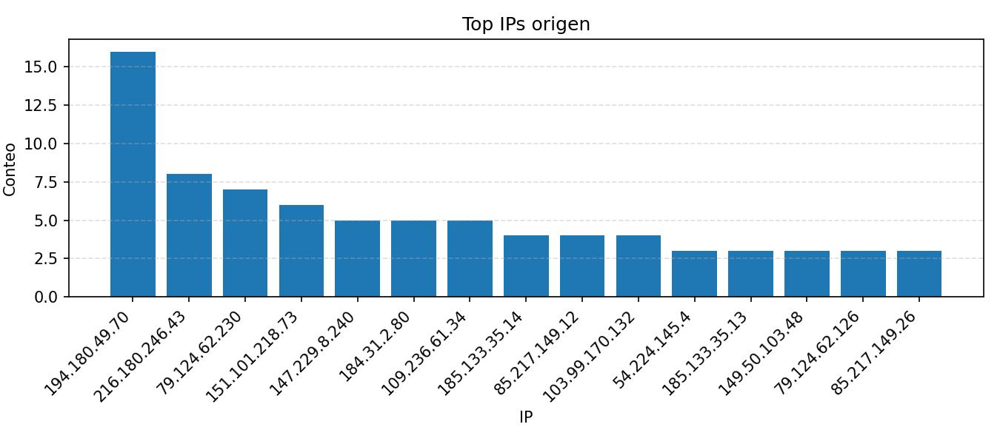

# UFW Block Report

- Log: `/var/log/ufw.log`
- Ventana: últimas 24.0 horas
- Total de bloqueos: 230
- IPs de origen únicas: 152
- Puertos destino únicos: 175

## Top puertos destino
| # | Puerto destino | Conteo | % |
| ---: | --- | ---: | ---: |
| 1 | `8333` | 17 | 7.4% |
| 2 | `23` | 9 | 3.9% |
| 3 | `44489` | 6 | 2.6% |
| 4 | `443` | 6 | 2.6% |
| 5 | `44532` | 4 | 1.7% |
| 6 | `45034` | 3 | 1.3% |
| 7 | `56664` | 3 | 1.3% |
| 8 | `8081` | 2 | 0.9% |
| 9 | `5061` | 2 | 0.9% |
| 10 | `2375` | 2 | 0.9% |
| 11 | `62082` | 2 | 0.9% |
| 12 | `56726` | 2 | 0.9% |
| 13 | `162` | 2 | 0.9% |
| 14 | `44499` | 2 | 0.9% |
| 15 | `53` | 2 | 0.9% |

## Top IPs origen
| # | IP origen | Conteo | % |
| ---: | --- | ---: | ---: |
| 1 | `194.180.49.70` | 16 | 7.0% |
| 2 | `216.180.246.43` | 8 | 3.5% |
| 3 | `79.124.62.230` | 7 | 3.0% |
| 4 | `151.101.218.73` | 6 | 2.6% |
| 5 | `147.229.8.240` | 5 | 2.2% |
| 6 | `184.31.2.80` | 5 | 2.2% |
| 7 | `109.236.61.34` | 5 | 2.2% |
| 8 | `185.133.35.14` | 4 | 1.7% |
| 9 | `85.217.149.12` | 4 | 1.7% |
| 10 | `103.99.170.132` | 4 | 1.7% |
| 11 | `54.224.145.4` | 3 | 1.3% |
| 12 | `185.133.35.13` | 3 | 1.3% |
| 13 | `149.50.103.48` | 3 | 1.3% |
| 14 | `79.124.62.126` | 3 | 1.3% |
| 15 | `85.217.149.26` | 3 | 1.3% |

## Top IP origen -> puerto destino
| # | IP origen -> puerto | Conteo | % |
| ---: | --- | ---: | ---: |
| 1 | `151.101.218.73` -> `44489` | 6 | 2.6% |
| 2 | `147.229.8.240` -> `8333` | 5 | 2.2% |
| 3 | `185.133.35.14` -> `44532` | 4 | 1.7% |
| 4 | `103.99.170.132` -> `8333` | 4 | 1.7% |
| 5 | `54.224.145.4` -> `45034` | 3 | 1.3% |
| 6 | `184.31.2.80` -> `56664` | 3 | 1.3% |
| 7 | `17.57.144.152` -> `62082` | 2 | 0.9% |
| 8 | `100.24.10.103` -> `8333` | 2 | 0.9% |
| 9 | `184.31.2.80` -> `56726` | 2 | 0.9% |
| 10 | `185.133.35.13` -> `44499` | 2 | 0.9% |
| 11 | `95.93.214.23` -> `23` | 2 | 0.9% |
| 12 | `103.99.170.131` -> `8333` | 2 | 0.9% |
| 13 | `109.236.61.34` -> `8092` | 2 | 0.9% |
| 14 | `185.244.104.2` -> `443` | 2 | 0.9% |
| 15 | `85.217.149.13` -> `52311` | 1 | 0.4% |

## Bloqueos por hora (UTC)
| Hora (UTC) | Conteo | % |
| :--- | ---: | ---: |
| 2025-12-10 16:00:00:00 | 24 | 10.4% |
| 2025-12-10 17:00:00:00 | 197 | 85.7% |
| 2025-12-10 18:00:00:00 | 6 | 2.6% |
| 2025-12-10 19:00:00:00 | 3 | 1.3% |

## Geolocalización (máx 15 IPs)
| # | IP origen | Conteo | % | Ubicación | Red / sospecha |
| ---: | --- | ---: | ---: | --- | --- |
| 1 | `194.180.49.70` | 16 | 20.3% | Germany / Bavaria / Berngau / HostSlick | Sin señal aparente |
| 2 | `216.180.246.43` | 8 | 10.1% | France / Île-de-France / Massy | Sin señal aparente |
| 3 | `79.124.62.230` | 7 | 8.9% | Seychelles / La Rivière Anglaise / Victoria / Internet Solutions & Innovations LTD | Sin señal aparente |
| 4 | `151.101.218.73` | 6 | 7.6% | Argentina / Buenos Aires F.D. / Buenos Aires / Fastly, Inc. | CDN/Edge (fastly) |
| 5 | `147.229.8.240` | 5 | 6.3% | Czechia / South Moravian / Tišnov / VUTBR | Sin señal aparente |
| 6 | `184.31.2.80` | 5 | 6.3% | Argentina / Buenos Aires F.D. / Buenos Aires / Akamai Technologies, Inc. | CDN/Edge (akamai) |
| 7 | `109.236.61.34` | 5 | 6.3% | The Netherlands / North Holland / Amsterdam / ColocationX Ltd | Hosting/Cloud (colo) |
| 8 | `185.133.35.14` | 4 | 5.1% | Brazil / São Paulo / Casa Verde / Linked Store Brasil Criacao E Desenvol De Software | Sin señal aparente |
| 9 | `85.217.149.12` | 4 | 5.1% | United States / New York / New York / Modat B.V | Sin señal aparente |
| 10 | `103.99.170.132` | 4 | 5.1% | United States / California / San Jose / WIZ K K | Sin señal aparente |
| 11 | `54.224.145.4` | 3 | 3.8% | United States / Virginia / Ashburn / AWS EC2 (us-east-1) | Hosting/Cloud (aws) |
| 12 | `185.133.35.13` | 3 | 3.8% | Brazil / São Paulo / Casa Verde / Linked Store Brasil Criacao E Desenvol De Software | Sin señal aparente |
| 13 | `149.50.103.48` | 3 | 3.8% | Poland / Mazovia / Warsaw / Meverywhere sp.zo.o | Sin señal aparente |
| 14 | `79.124.62.126` | 3 | 3.8% | Seychelles / La Rivière Anglaise / Victoria / Internet Solutions & Innovations LTD | Sin señal aparente |
| 15 | `85.217.149.26` | 3 | 3.8% | United States / New York / New York / Modat B.V | Sin señal aparente |

## Sospecha de VPN/Proxy/Hosting (heurística)
| # | IP origen | Conteo | % | Sospecha | Ubicación |
| ---: | --- | ---: | ---: | --- | --- |
| 1 | `151.101.218.73` | 6 | 31.6% | CDN/Edge (fastly) | Argentina / Buenos Aires F.D. / Buenos Aires / Fastly, Inc. |
| 2 | `184.31.2.80` | 5 | 26.3% | CDN/Edge (akamai) | Argentina / Buenos Aires F.D. / Buenos Aires / Akamai Technologies, Inc. |
| 3 | `109.236.61.34` | 5 | 26.3% | Hosting/Cloud (colo) | The Netherlands / North Holland / Amsterdam / ColocationX Ltd |
| 4 | `54.224.145.4` | 3 | 15.8% | Hosting/Cloud (aws) | United States / Virginia / Ashburn / AWS EC2 (us-east-1) |

## Gráficos

