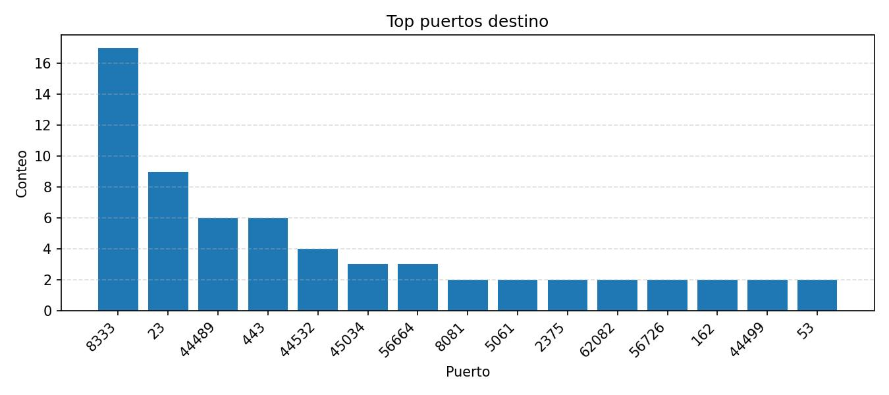
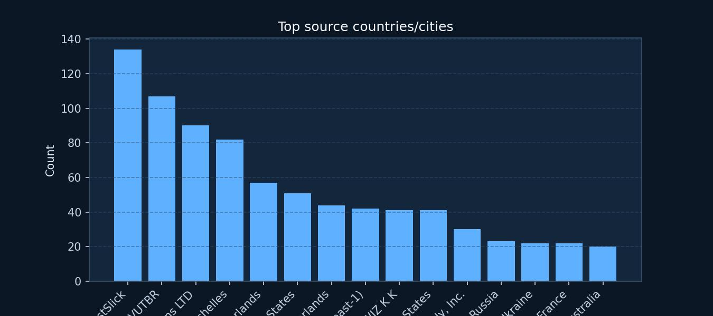
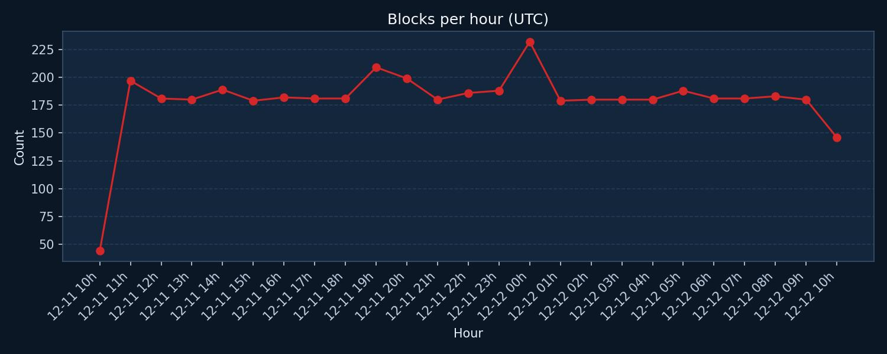
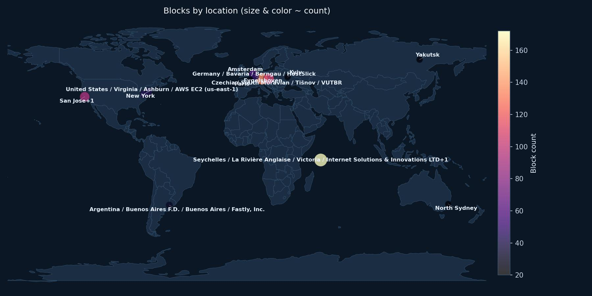

# UFW Block Report

- Log: `/var/log/ufw.log`
- Window: last 24.0 hours
- Total blocks: 4367
- Unique source IPs: 2341
- Unique countries/cities (24h): 317
- Unique destination ports: 2381

## Top destination ports
| # | Destination port | Count | % |
| ---: | --- | ---: | ---: |
| 1 | `23` | 156 | 3.6% |
| 2 | `22` | 82 | 1.9% |
| 3 | `8080` | 58 | 1.3% |
| 4 | `5060` | 35 | 0.8% |
| 5 | `3389` | 34 | 0.8% |
| 6 | `1433` | 31 | 0.7% |
| 7 | `53` | 30 | 0.7% |
| 8 | `8443` | 24 | 0.5% |
| 9 | `2222` | 24 | 0.5% |
| 10 | `8081` | 23 | 0.5% |
| 11 | `17000` | 20 | 0.5% |
| 12 | `3306` | 19 | 0.4% |
| 13 | `17001` | 19 | 0.4% |
| 14 | `6036` | 18 | 0.4% |
| 15 | `8000` | 17 | 0.4% |

## Top protocols
| # | Protocol | Count | % |
| ---: | --- | ---: | ---: |
| 1 | `TCP` | 3953 | 90.5% |
| 2 | `UDP` | 403 | 9.2% |
| 3 | `47` | 9 | 0.2% |
| 4 | `4` | 1 | 0.0% |
| 5 | `41` | 1 | 0.0% |

## Top source IPs
| # | Source IP | Count | % |
| ---: | --- | ---: | ---: |
| 1 | `161.97.162.119` | 91 | 2.1% |
| 2 | `185.105.109.142` | 51 | 1.2% |
| 3 | `216.180.246.202` | 50 | 1.1% |
| 4 | `5.61.209.106` | 18 | 0.4% |
| 5 | `151.101.216.159` | 17 | 0.4% |
| 6 | `91.231.89.0` | 17 | 0.4% |
| 7 | `91.231.89.224` | 17 | 0.4% |
| 8 | `91.230.168.233` | 16 | 0.4% |
| 9 | `91.196.152.35` | 16 | 0.4% |
| 10 | `91.231.89.10` | 16 | 0.4% |
| 11 | `91.196.152.190` | 16 | 0.4% |
| 12 | `45.198.224.125` | 15 | 0.3% |
| 13 | `85.217.140.33` | 15 | 0.3% |
| 14 | `91.230.168.129` | 15 | 0.3% |
| 15 | `91.231.89.215` | 15 | 0.3% |

## Top TCP flag patterns
| # | Flags | Count | % |
| ---: | --- | ---: | ---: |
| 1 | `SYN` | 3844 | 97.2% |
| 2 | `ACK+FIN+PSH` | 46 | 1.2% |
| 3 | `ACK+PSH` | 37 | 0.9% |
| 4 | `SYN+ECE+CWR` | 17 | 0.4% |
| 5 | `ACK+FIN` | 8 | 0.2% |
| 6 | `ACK` | 1 | 0.0% |

## Top inbound interfaces (IN)
| # | Interface | Count | % |
| ---: | --- | ---: | ---: |
| 1 | `eth0` | 4367 | 100.0% |

## Top source IP -> destination port
| # | Source IP -> port | Count | % |
| ---: | --- | ---: | ---: |
| 1 | `216.180.246.202` -> `4248` | 8 | 0.2% |
| 2 | `216.180.246.202` -> `4343` | 8 | 0.2% |
| 3 | `216.180.246.202` -> `4434` | 8 | 0.2% |
| 4 | `45.198.224.125` -> `8080` | 7 | 0.2% |
| 5 | `201.20.85.122` -> `6379` | 7 | 0.2% |
| 6 | `216.180.246.202` -> `4443` | 7 | 0.2% |
| 7 | `151.101.216.159` -> `58698` | 6 | 0.1% |
| 8 | `2.23.164.166` -> `7623` | 6 | 0.1% |
| 9 | `216.180.246.59` -> `8080` | 6 | 0.1% |
| 10 | `216.180.246.202` -> `4433` | 6 | 0.1% |
| 11 | `109.94.173.183` -> `3389` | 5 | 0.1% |
| 12 | `178.20.210.152` -> `1723` | 5 | 0.1% |
| 13 | `180.93.244.95` -> `5926` | 5 | 0.1% |
| 14 | `45.198.224.125` -> `9090` | 5 | 0.1% |
| 15 | `2.23.164.84` -> `62980` | 5 | 0.1% |

## Blocks per hour (UTC)
| Hour (UTC) | Count | % |
| :--- | ---: | ---: |
| 2026-09-30 04:00:00:00 | 147 | 3.4% |
| 2026-09-30 05:00:00:00 | 179 | 4.1% |
| 2026-09-30 06:00:00:00 | 181 | 4.1% |
| 2026-09-30 07:00:00:00 | 180 | 4.1% |
| 2026-09-30 08:00:00:00 | 180 | 4.1% |
| 2026-09-30 09:00:00:00 | 191 | 4.4% |
| 2026-09-30 10:00:00:00 | 180 | 4.1% |
| 2026-09-30 11:00:00:00 | 180 | 4.1% |
| 2026-09-30 12:00:00:00 | 176 | 4.0% |
| 2026-09-30 13:00:00:00 | 179 | 4.1% |
| 2026-09-30 14:00:00:00 | 200 | 4.6% |
| 2026-09-30 15:00:00:00 | 184 | 4.2% |
| 2026-09-30 16:00:00:00 | 178 | 4.1% |
| 2026-09-30 17:00:00:00 | 180 | 4.1% |
| 2026-09-30 18:00:00:00 | 181 | 4.1% |
| 2026-09-30 19:00:00:00 | 175 | 4.0% |
| 2026-09-30 20:00:00:00 | 183 | 4.2% |
| 2026-09-30 21:00:00:00 | 179 | 4.1% |
| 2026-09-30 22:00:00:00 | 183 | 4.2% |
| 2026-09-30 23:00:00:00 | 178 | 4.1% |
| 2026-10-01 00:00:00:00 | 181 | 4.1% |
| 2026-10-01 01:00:00:00 | 180 | 4.1% |
| 2026-10-01 02:00:00:00 | 188 | 4.3% |
| 2026-10-01 03:00:00:00 | 181 | 4.1% |
| 2026-10-01 04:00:00:00 | 43 | 1.0% |

## Top source countries/cities
| # | Location | Count | % |
| ---: | --- | ---: | ---: |
| 1 | Lauterbourg, France | 91 | 23.6% |
| 2 | Gravelines, France | 80 | 20.8% |
| 3 | Moscow, Russia | 51 | 13.2% |
| 4 | Massy, France | 50 | 13.0% |
| 5 | Roubaix, France | 32 | 8.3% |
| 6 | Hillsboro, United States | 31 | 8.1% |
| 7 | Amsterdam, The Netherlands | 18 | 4.7% |
| 8 | Buenos Aires, Argentina | 17 | 4.4% |
| 9 | Stockholm, Sweden | 15 | 3.9% |

## Geolocation (max 15 IPs)
| # | Source IP | Count | % | Location | Network / hint |
| ---: | --- | ---: | ---: | --- | --- |
| 1 | `161.97.162.119` | 91 | 23.6% | France / Grand Est / Lauterbourg / Contabo GmbH | Hosting/Cloud (contabo) |
| 2 | `185.105.109.142` | 51 | 13.2% | Russia / Moscow / Moscow / EuroByte LLC | No apparent signal |
| 3 | `216.180.246.202` | 50 | 13.0% | France / Île-de-France / Massy / Internet Utilities NA LLC | Hosting/Cloud (google llc) |
| 4 | `5.61.209.106` | 18 | 4.7% | The Netherlands / North Holland / Amsterdam / Amarutu Technology Ltd. Network | No apparent signal |
| 5 | `151.101.216.159` | 17 | 4.4% | Argentina / Buenos Aires F.D. / Buenos Aires / Fastly, Inc. | CDN/Edge (fastly) |
| 6 | `91.231.89.0` | 17 | 4.4% | France / Hauts-de-France / Gravelines / ONYPHE | No apparent signal |
| 7 | `91.231.89.224` | 17 | 4.4% | France / Hauts-de-France / Gravelines / ONYPHE | No apparent signal |
| 8 | `91.230.168.233` | 16 | 4.2% | United States / Oregon / Hillsboro / ONYPHE | No apparent signal |
| 9 | `91.196.152.35` | 16 | 4.2% | France / Hauts-de-France / Roubaix / ONYPHE | No apparent signal |
| 10 | `91.231.89.10` | 16 | 4.2% | France / Hauts-de-France / Gravelines / ONYPHE | No apparent signal |
| 11 | `91.196.152.190` | 16 | 4.2% | France / Hauts-de-France / Roubaix / ONYPHE | No apparent signal |
| 12 | `45.198.224.125` | 15 | 3.9% | Sweden / Stockholm County / Stockholm / Vpsvault.host LTD | No apparent signal |
| 13 | `85.217.140.33` | 15 | 3.9% | France / Hauts-de-France / Gravelines / Modat B.V | No apparent signal |
| 14 | `91.230.168.129` | 15 | 3.9% | United States / Oregon / Hillsboro / ONYPHE | No apparent signal |
| 15 | `91.231.89.215` | 15 | 3.9% | France / Hauts-de-France / Gravelines / ONYPHE | No apparent signal |

## VPN/Proxy/Hosting suspicion (heuristic)
| # | Source IP | Count | % | Suspicion | Location |
| ---: | --- | ---: | ---: | --- | --- |
| 1 | `161.97.162.119` | 91 | 57.6% | Hosting/Cloud (contabo) | France / Grand Est / Lauterbourg / Contabo GmbH |
| 2 | `216.180.246.202` | 50 | 31.6% | Hosting/Cloud (google llc) | France / Île-de-France / Massy / Internet Utilities NA LLC |
| 3 | `151.101.216.159` | 17 | 10.8% | CDN/Edge (fastly) | Argentina / Buenos Aires F.D. / Buenos Aires / Fastly, Inc. |

## Charts

